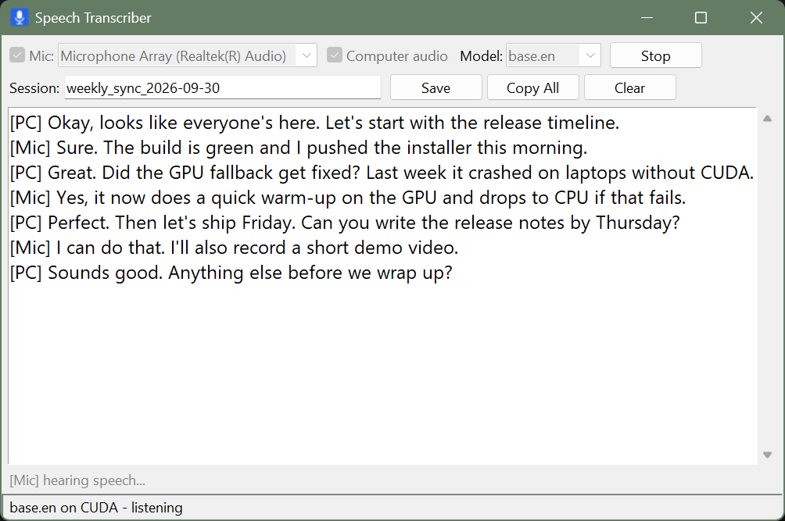
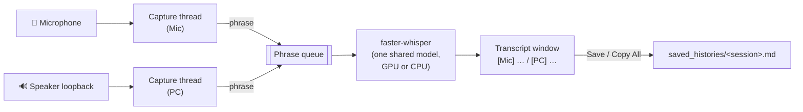
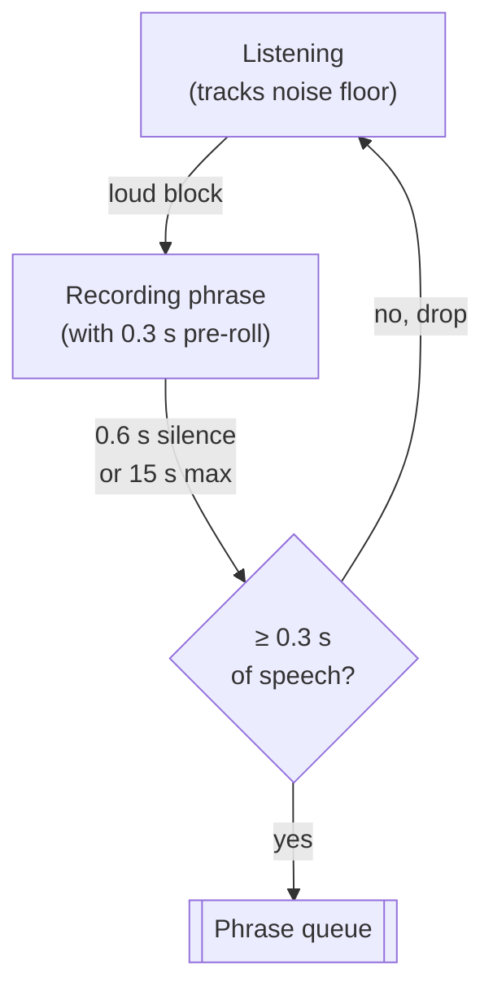

# Speech Transcriber

Offline live transcription of mic + PC audio. You're `[Mic]`, the call is `[PC]`;
save as Markdown for an LLM to summarize.



**Overview page:** https://anoted.github.io/audio_transcript/

## Features

- Transcribes the mic and a WASAPI loopback of the default speaker simultaneously
- Runs locally with [faster-whisper](https://github.com/SYSTRAN/faster-whisper) — no audio leaves your machine
- Uses the GPU (CUDA) when available, falls back to CPU automatically
- Choose `tiny.en`, `base.en` (default) or `small.en` for speed vs. accuracy
- **Save** (Ctrl+S) writes `saved_histories/<session>.md`; **Copy All** puts the same text on the clipboard
- The saved file starts with an instruction block asking an LLM for a summary, key decisions and next steps

## How it works



Each capture thread cuts its audio into phrases like this:



1. Each source is recorded in 100 ms blocks at 16 kHz on its own thread.
2. A running noise floor decides what counts as "loud". Speech starts a phrase; 0.6 s of
   silence ends it (long phrases are cut at the next short pause, hard cut at 15 s).
   Blips under 0.3 s are dropped.
3. Finished phrases go into one shared queue and a single faster-whisper model transcribes
   them in arrival order, with VAD filtering to skip non-speech.
4. Text lands in the window tagged with its source. The gray line under the transcript shows
   what's happening live (`hearing speech…`, `transcribing…`).

## Install and run

Requires Python 3.10+. The first run downloads the selected Whisper model
(into `~/.cache/huggingface`); after that it works offline.

**Windows**

```bat
pip install -r requirements.txt
python transcriber.py
```

Or build a standalone `dist\transcriber.exe` with PyInstaller:

```bat
build.bat
```

**Linux**

```bash
./setup.sh          # add --gpu to also install the CUDA libraries
./run.sh
```

> Computer-audio capture relies on loopback recording, which works out of the box with
> WASAPI on Windows and PulseAudio/PipeWire monitor sources on Linux.

### GPU

GPU mode needs CUDA 12 cuBLAS and cuDNN 9. The app picks them up from an installed PyTorch
or from the `nvidia-cublas-cu12` / `nvidia-cudnn-cu12` pip wheels. If the GPU can't be used,
it quietly runs on CPU with int8.

## Saved file format

```markdown
# weekly_sync_2026-09-30

Saved: 2026-09-30 15:00

## Instruction:

Make a Markdown report on what was discussed. What are the next steps? ...

## RAW:

[PC] Okay, looks like everyone's here. Let's start with the release timeline.
[Mic] Sure. The build is green and I pushed the installer this morning.
```

## License

[MIT](LICENSE)
